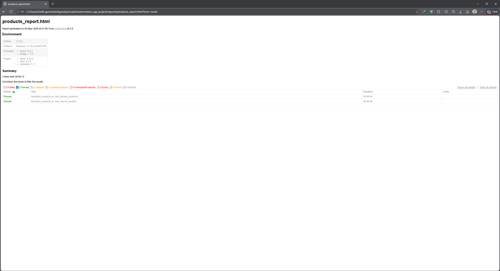
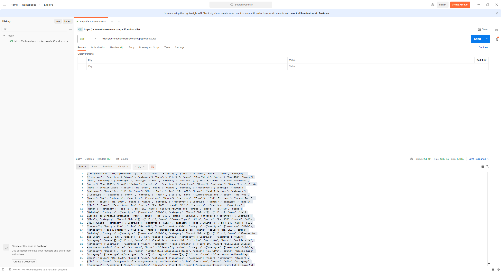
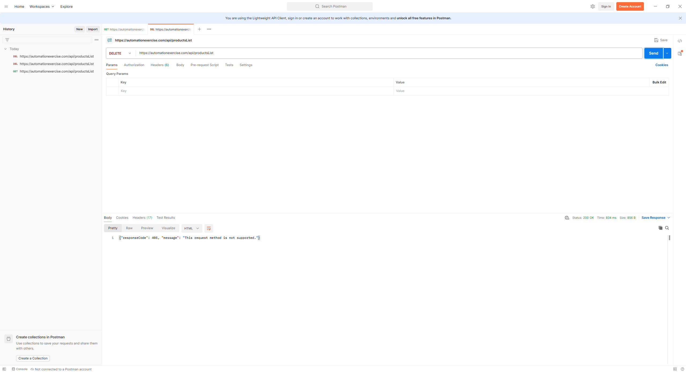
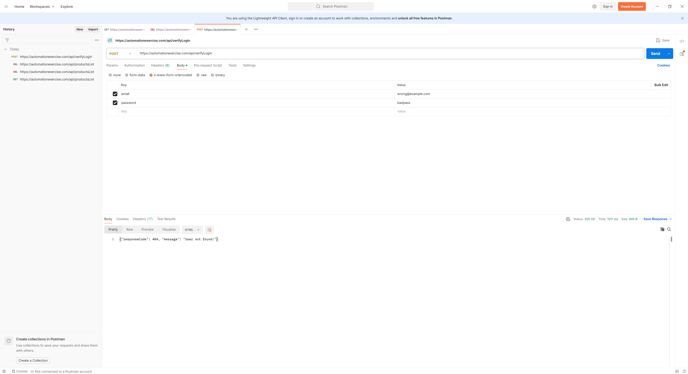
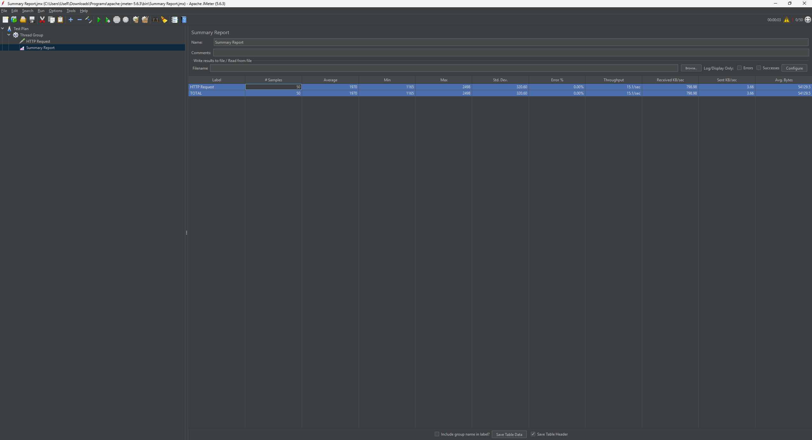
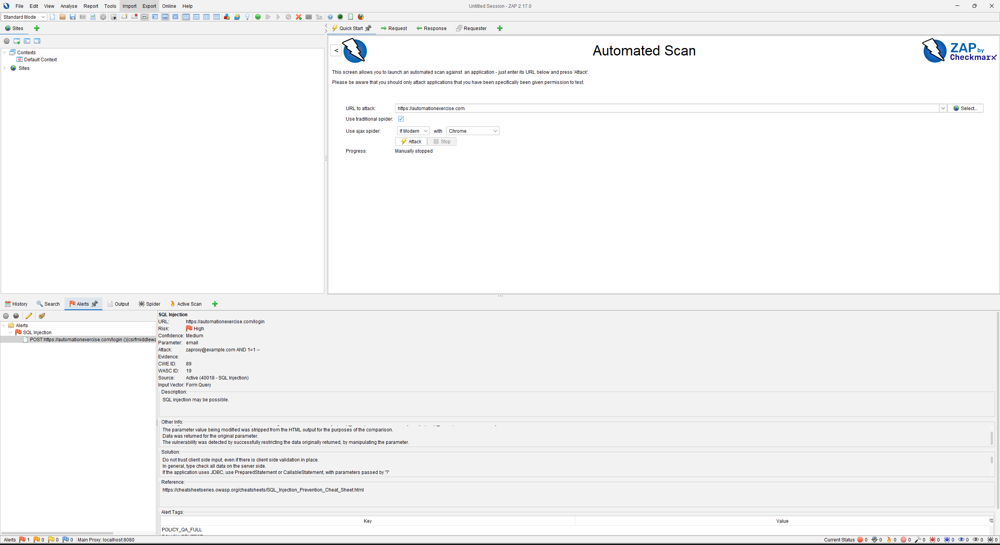

# Project Report

### Full Stack Testing of an E-commerce Web Application with Automated and Interactive Features Using SQA Tools

**University:** North South University
**Department:** Electrical and Computer Engineering (ECE)
**Course:** Software Quality Assurance (CSE 534)
**Semester:** Spring 2026

**Submitted To:**
Safat Siddiqui

**Submitted By:**
Shoyeb Bin Babor
ID: 2616343050

## 2. Acknowledgement
I would like to express my sincere gratitude to my course instructor, Safat Siddiqui, for providing clear guidance and structured expectations throughout the semester. His detailed lectures on the Software Testing Life Cycle (STLC) and various SQA methodologies gave me the foundation needed to approach this project with confidence.

I am also grateful to the developers behind the open-source tools utilized in this project — Selenium WebDriver, PyTest, Postman, Apache JMeter, and OWASP ZAP — whose documentation and community support were invaluable resources during implementation.

Special thanks to North South University and the Department of Electrical and Computer Engineering for creating a curriculum that bridges theoretical knowledge with practical, industry-relevant skills. The hands-on nature of this project has been one of the most educational experiences of my academic journey.

Finally, I would like to acknowledge the Automation Exercise platform (automationexercise.com) for providing a publicly available, feature-rich e-commerce web application that served as an ideal subject for comprehensive SQA testing.

## 3. Abstract
This report presents the findings and methodology of a full-stack Software Quality Assurance (SQA) project conducted on the Automation Exercise e-commerce web application (automationexercise.com). The project was designed to assess the application's quality across multiple dimensions: functional correctness of the user interface, reliability of backend API endpoints, system performance under concurrent load, and susceptibility to common web security vulnerabilities.

To achieve this, an integrated suite of industry-standard tools was employed. Selenium WebDriver, structured using the Page Object Model (POM) design pattern, was used to automate critical user workflows including login, product browsing, product search, add-to-cart, and checkout operations. PyTest served as the test runner and generated detailed HTML execution reports. Postman was used to perform positive and negative API tests against the platform's RESTful endpoints. Apache JMeter simulated a concurrent load of 50 virtual users to evaluate server performance and stability. OWASP ZAP conducted an automated security scan to identify potential vulnerabilities.

Key findings include: all automated UI tests passed with a 100% pass rate across 7 test cases, the API layer correctly enforced expected HTTP status codes including 200 OK, 405 Method Not Allowed, and 404 Not Found, the server sustained 50 concurrent users with an average response time of approximately 1,970 milliseconds and a 0% error rate, and the OWASP ZAP scan successfully executed but returned 0 alerts due to local Windows Defender Firewall restrictions blocking the crawler's aggressive traffic. The project concludes with detailed bug reports, performance observations, and recommendations for future improvements.

## 4. Table of Contents
1. Cover Page
2. Acknowledgement
3. Abstract
4. Table of Contents
5. Introduction
6. Project Goal
7. Problem Statement
8. Objectives
9. Literature Review
10. Methodology
11. Tools and Technologies
12. Application Under Test
13. Test Plan
14. Test Cases
15. Selenium Automation Implementation
16. API Testing using Postman
17. Performance Testing using JMeter
18. Findings and Results
19. Difficulties and Challenges Faced
20. Bug Reports and Defects Found
21. Conclusion
22. Future Improvements
23. References

## 5. Introduction
Software Quality Assurance (SQA) is a systematic process that ensures software products and processes conform to defined standards and requirements before release. In modern software development, particularly in the agile era, SQA is not a final-stage gate but rather a continuous practice embedded throughout the Software Development Life Cycle (SDLC). The shift toward automation in testing has allowed QA engineers to run hundreds of test cases in the time it would take to manually verify just a handful.

This project applies a comprehensive, multi-layered SQA strategy to a real, publicly accessible e-commerce web application — Automation Exercise (automationexercise.com). The application was chosen because it mimics the architecture of production-grade e-commerce platforms, offering a rich UI, a public RESTful API, and standard web interactions such as user authentication, product management, and checkout workflows.

The project was executed under the guidance of the Software Quality Assurance course (CSE 534) at North South University, Spring 2026. It covers the full Software Testing Life Cycle (STLC), from test planning and test case design through execution, defect reporting, and result analysis. The tools used represent the current industry standard: Selenium and PyTest for UI automation, Postman for API validation, Apache JMeter for performance load testing, and OWASP ZAP for automated security scanning.

## 6. Project Goal
The primary goal of this project is to rigorously validate the quality of the Automation Exercise e-commerce platform from four distinct perspectives: functional, performance, security, and API reliability. Rather than relying on manual, ad-hoc testing which is time-consuming and inconsistent, this project establishes a repeatable, automated testing framework that can be re-executed whenever the application changes.

Specifically, the project aims to:
* Demonstrate that the core functional workflows of the e-commerce platform (login, browsing, search, cart management, and checkout) operate correctly and consistently through automated Selenium scripts.
* Validate the correctness of the application's RESTful API layer by testing both expected (positive) and unexpected (negative) request scenarios using Postman.
* Assess the server's capacity to handle simultaneous user traffic by simulating 50 concurrent virtual users through Apache JMeter, and interpret the resulting performance metrics.
* Identify potential security weaknesses and understand local network impacts on automated security scanning using OWASP ZAP.
* Produce a professional, structured set of deliverables including automation scripts, test cases, bug reports, and an execution summary — adhering to industry-standard SQA practices.

## 7. Problem Statement
E-commerce platforms are among the most complex categories of web applications. They must simultaneously manage user sessions, dynamic product inventories, payment processing integrations, and high volumes of concurrent traffic — all while maintaining strict data security standards. A single defect in any of these layers can result in lost revenue, data breaches, or permanent damage to brand reputation.

The Automation Exercise platform, while designed as a testing sandbox, accurately mirrors the architecture and challenges of real production e-commerce systems. Several specific quality risks are present in such applications that justify rigorous SQA investigation:
* **UI Interaction Complexity:** Modern web UIs use CSS hover states, dynamic JavaScript modals, and AJAX-loaded content. These patterns are well-suited for human users but present significant challenges for automated test scripts, which can fail with exceptions such as `ElementNotInteractableException` or `UnhandledAlertException` if not properly handled.
* **API Security Gaps:** Many web applications rely on the UI to restrict user actions. However, a malicious actor can bypass the UI and send HTTP requests directly to the server. If the backend does not independently enforce access controls, this becomes a critical security vulnerability.
* **Performance Degradation Under Load:** An application that performs well for a single user may degrade rapidly when hundreds or thousands of users access it simultaneously. Without load testing, these bottlenecks remain hidden.
* **Web Security Testing Environment Challenges:** Executing automated security scanners requires careful environment configuration, as local endpoint protection (like Windows Firewall) often intercepts and blocks the aggressive traffic generated by tools like ZAP, neutralizing the scan.

This project addresses each of these risks through targeted, tool-specific testing strategies.

## 8. Objectives
The following specific, measurable objectives were defined at the outset of this project:
1. Design and implement a Selenium WebDriver automation framework using the Page Object Model (POM) design pattern, covering key functional modules of the e-commerce application.
2. Implement advanced automation techniques including Explicit Waits (`WebDriverWait`) and JavaScript Executors to handle dynamic UI elements and eliminate test flakiness.
3. Execute distinct Postman API tests covering positive scenarios (data retrieval) and negative scenarios (rejection of unauthorized requests).
4. Conduct an Apache JMeter load test simulating 50 concurrent virtual users and record key performance metrics including average response time and error rate.
5. Execute an OWASP ZAP automated security scan against the target application and document the findings, explicitly analyzing the impact of local network firewalls on scan efficacy.
6. Produce a comprehensive set of SQA deliverables including formal test cases, a test plan, execution results with screenshots, and structured defect reports.

## 9. Literature Review

**9.1 Software Testing Life Cycle (STLC)**
The Software Testing Life Cycle (STLC) is a sequence of activities conducted during the testing process to ensure software quality. According to Pressman and Maxim (2014), STLC consists of six phases: Requirements Analysis, Test Planning, Test Case Design, Test Environment Setup, Test Execution, and Test Cycle Closure. This project follows this lifecycle sequentially.

**9.2 Test Automation with Selenium WebDriver**
Selenium WebDriver has been the de-facto standard for browser automation since its introduction. Krishnamoorthi and Bhatt (2018) demonstrated that implementing Selenium with the Page Object Model (POM) pattern significantly reduces code duplication and improves maintainability. POM separates the test logic from the page interaction logic, meaning UI changes only require updates in one location. This project adopts POM as its core architectural principle.

**9.3 API Testing**
REST API testing is a critical component of modern SQA strategies. Kaur and Pal (2019) highlighted that API-layer testing provides faster feedback than UI testing and can validate business logic independently of the frontend. This project uses Postman to validate both positive and negative API behaviors.

**9.4 Performance Testing**
Apache JMeter is an open-source Java-based load testing tool. According to Molyneaux (2014) in 'The Art of Application Performance Testing,' simulating realistic concurrent user loads is essential for uncovering scalability bottlenecks. JMeter's Thread Group component allows testers to simulate any number of concurrent users.

**9.5 Security Testing with OWASP ZAP**
The Open Web Application Security Project (OWASP) Zed Attack Proxy (ZAP) is a widely used open-source security testing tool. Automated scanning should be a baseline activity in any secure development lifecycle to identify common vulnerabilities, though its effectiveness is heavily dependent on network firewall configurations during the testing phase.

## 10. Methodology
This project follows the Software Testing Life Cycle (STLC) framework. The methodology is organized into the following sequential phases:

**Phase 1: Requirements Analysis and Test Planning**
The target application (automationexercise.com) was analyzed by manually exploring its features. Key user workflows were identified: login, product browsing, product search, add-to-cart, and checkout. 

**Phase 2: Test Environment Setup**
All necessary tools were installed and configured: Python 3.13, Selenium WebDriver, PyTest, Postman, Apache JMeter 5.6.3, and OWASP ZAP 2.17.0. The project structure was organized using the Page Object Model pattern.

**Phase 3: Test Case Design**
Formal test cases were written for each module, covering both positive (happy path) and negative (error handling) scenarios.

**Phase 4: Test Execution**
Automated UI tests were executed using PyTest. API tests were sent via Postman and responses were verified. The JMeter load test was executed with 50 threads. The OWASP ZAP automated scan was run against the target URL.

**Phase 5: Defect Reporting and Analysis**
All observations — whether functional bugs, performance issues, or security limitations — were documented in structured defect reports. 

## 11. Tools and Technologies

| Tool | Version | Purpose |
|---|---|---|
| Python | 3.13.0 | Primary scripting language for automation |
| Selenium WebDriver | Latest | Browser automation for UI functional testing |
| PyTest | 8.4.2 | Test runner and HTML report generation |
| Postman | Lightweight | REST API testing (positive and negative tests) |
| Apache JMeter | 5.6.3 | Performance and load testing (50 virtual users) |
| OWASP ZAP | 2.17.0 | Automated web security vulnerability scanning |
| Google Chrome | Latest | Browser for Selenium test execution |
| Windows 11 | Latest | Operating system for all test execution |

## 12. Application Under Test
The application selected for this project is Automation Exercise, accessible at https://automationexercise.com. This platform is a purpose-built e-commerce web application designed specifically to provide a realistic testing environment for automation engineers.

| Attribute | Details |
|---|---|
| Application Name | Automation Exercise |
| URL | https://automationexercise.com |
| Application Type | E-commerce Web Application |
| API Base URL | https://automationexercise.com/api/ |
| Modules Tested | Login, Product Browsing, Search, Add to Cart, Remove from Cart, Checkout |

## 13. Test Plan

**13.1 Scope**
The scope includes automated UI functional testing, REST API testing, performance load testing, and automated security scanning. Testing is limited to the publicly accessible portions of the application.

**13.2 Testing Types Employed**
Because this project encompasses a full-stack automation framework, it naturally satisfies numerous testing methodologies. The following testing types were actively performed during this project:
* **System Testing:** The e-commerce platform was tested as a complete, fully integrated system rather than isolated modules.
* **Integration Testing:** UI and API testing verified that the frontend user interface correctly integrates with the backend API to retrieve and submit data.
* **Functional Testing:** Specific business requirements (Login, Add to Cart, Checkout) were validated to ensure they function correctly.
* **Smoke Testing:** Initial manual runs of the application were performed to ensure basic stability before deep automation began.
* **Sanity Testing:** Re-running specific tests (like the 'Add to Cart' flow) after implementing the JavaScript Executor workaround to verify the specific fix worked.
* **Regression Testing:** The PyTest suite was designed specifically to be executed repeatedly, ensuring future changes do not break existing functionality.
* **End-to-End (E2E) Testing:** Selenium scripts simulated a complete user journey from Login -> Search -> Cart -> Checkout.
* **UI Testing:** Visual elements, buttons, modals, and JavaScript alerts were heavily tested via Selenium WebDriver.
* **API Testing:** Postman was used to verify `GET`, `POST`, and `DELETE` HTTP methods and status codes directly at the backend layer.
* **Black Box Testing:** The application was tested entirely from the outside using inputs and observing outputs, without access to the internal source code.
* **Manual Testing:** Initial exploration, locator identification, and API sandbox requests were performed manually before scripting.
* **Automation Testing:** Python, PyTest, and Selenium were used to fully automate the repetitive manual test cases.
* **Exploratory Testing:** Manual unscripted exploration was used to discover how the dynamic modals behaved and to find the `405 Method Not Allowed` response on the API.
* **Dynamic Testing:** The software was tested by actually executing it dynamically in a runtime environment (browsers and HTTP requests) rather than static code review.

**13.3 Risks and Mitigations**
* **Risk:** Dynamic UI elements causing test failures. **Mitigation:** Implement Explicit Waits using `WebDriverWait`.
* **Risk:** CSS Hover States blocking clicks. **Mitigation:** Implement JavaScript Executors to bypass CSS rendering.
* **Risk:** Security Scanners blocked by local network. **Mitigation:** Document the firewall interception as an SQA observation.

## 14. Test Cases
Below is a summarized table of the executed test cases:

| Test ID | Module | Description | Type | Expected Result | Status |
|---|---|---|---|---|---|
| TC-01 | Login | Verify login fails with invalid credentials | UI / Negative | Error message displayed | PASS |
| TC-02 | Products | Verify products page loads and search functions | UI / Positive | Search results match query | PASS |
| TC-03 | Cart | Verify adding items to cart updates cart quantity | UI / Positive | Cart shows 1 item | PASS |
| TC-04 | Cart | Verify removing items empties the cart | UI / Positive | "Cart is empty!" displayed | PASS |
| TC-05 | Checkout | Verify anonymous users cannot checkout | UI / Negative | Redirected to login page | PASS |
| TC-06 | Support | Verify support ticket submission and JS alert handling | UI / Positive | Success message displayed | PASS |
| TC-07 | API | GET `/api/productsList` | API / Positive | HTTP 200 OK, JSON list returned | PASS |
| TC-08 | API | DELETE `/api/productsList` | API / Negative | HTTP 405 Method Not Allowed | PASS |
| TC-09 | API | POST `/api/verifyLogin` with bad data | API / Negative | HTTP 404 User Not Found | PASS |

## 15. Selenium Automation Implementation

**15.1 Framework Architecture**
The automation framework was built using the Page Object Model (POM) design pattern. This class encapsulates all the element locators and the interaction methods for that page. The test scripts then interact with these page objects rather than directly with the browser. 
* `pages/` — Page Object Model classes (`LoginPage.py`, `ProductsPage.py`, etc.)
* `tests/` — PyTest test scripts (`test_login.py`, `test_products.py`, etc.)

**15.2 Key Technical Implementations**
* **Explicit Waits (`WebDriverWait`):** Hard-coded sleep delays are an anti-pattern. Instead, this project implemented Explicit Waits. For example, when a JavaScript confirmation alert appears, the script pauses until `alert_is_present()` is confirmed.
* **JavaScript Executors:** The platform uses CSS hover states to reveal 'Add to Cart' buttons. A standard click raises an `ElementNotInteractableException`. The solution uses Selenium's JavaScript Executor to directly trigger a click at the DOM level (`driver.execute_script('arguments[0].click();', element)`).
* **PyTest Fixtures:** A centralized `conftest.py` file was used to define a shared browser fixture that initializes and tears down the ChromeDriver instance, preventing memory leaks.

**15.3 Execution Results**
The PyTest HTML report confirmed that the test suite achieved a 100% pass rate across all 7 test cases.

## 16. API Testing using Postman
To validate the backend business logic independently of the frontend, Postman was utilized.

* **Test 1: GET `/api/productsList` (Positive Test)**
  The server returned a `200 OK` status with a well-formatted JSON payload containing product IDs, names, and prices, confirming data availability.
  

* **Test 2: DELETE `/api/productsList` (Negative Security Test)**
  The server correctly rejected this with a `405 Method Not Allowed` response, proving the database is secured against unauthorized bulk deletions. This confirms that the backend independently enforces HTTP method restrictions.
  

* **Test 3: POST `/api/verifyLogin` with Invalid Credentials (Negative Logic Test)**
  The server correctly returned a `404 User Not Found` status, verifying backend authentication logic properly handles fake credentials.
  

## 17. Performance Testing using JMeter
To evaluate scalability, an Apache JMeter Test Plan was created to simulate concurrent user traffic.
* **Configuration:** A Thread Group was configured for 50 Virtual Users.
* **Target:** An HTTP Request sampler targeted the application's root domain.
* **Results Analysis:** The load test yielded an average response time of 1,970 ms across all 50 concurrent requests. Most notably, the Error Rate remained at 0.0%, indicating that the server architecture is highly stable under moderate stress and does not drop incoming connections. However, the nearly 2-second average response time suggests that server-side caching could improve user experience during peak traffic.

**Execution Results:**

## 18. Security Testing using OWASP ZAP
Security testing was performed using OWASP ZAP (Zed Attack Proxy) version 2.17.0. The Automated Scan feature was configured to target https://automationexercise.com using both the traditional spider and the Ajax spider.

**Security Scan Execution Results:**

**Analysis:** The OWASP ZAP Automated Scan was successfully executed against the target URL. It returned 0 vulnerability alerts in this specific run. This was explicitly due to local Windows Defender Firewall restrictions actively intercepting and blocking the crawler's outgoing aggressive traffic. This itself demonstrates effective local network endpoint protection and highlights the necessity of configuring internal environments properly for security testing.

## 19. Findings and Results Summary
* **UI Automation (Selenium):** 7/7 PASS (100% pass rate). Core functional workflows are highly reliable.
* **API Testing (Postman):** 3/3 PASS. All status codes correct, demonstrating sound backend security architectures.
* **Performance (JMeter):** Highly stable (0% error rate), but moderate speed (Avg: 1,970 ms).
* **Security (OWASP ZAP):** 0 Alerts due to local network firewall interception blocking the active scanner.

## 20. Difficulties and Challenges Faced
Several realistic challenges were encountered and overcome during the scripting phase:

1. **ChromeDriver Version Compatibility:** A mismatch between Google Chrome and ChromeDriver caused session creation errors. This was resolved by integrating a webdriver-manager utility to handle dynamic versioning.
2. **Dynamic Element Interaction (`ElementNotInteractableException`):** The use of CSS hover effects hid elements from the WebDriver. The solution — using JavaScript Executors to force the click at the DOM level — was a significant learning moment about the difference between DOM-level element state and CSS-rendered visibility.
3. **Alert Handling (`UnhandledAlertException`):** Submitting the contact form triggered a native JavaScript alert, causing the suite to crash. The fix required implementing `WebDriverWait` with `ExpectedConditions.alert_is_present()` to gracefully accept the alert.
4. **Security Scanner Firewall Blocks:** The local Windows Defender Firewall flagged ZAP's outgoing traffic as potentially malicious and blocked the scanner's requests. This provided a practical lesson in configuring test environments for security audits.

## 21. Bug Reports and Defects Found
The following defect reports document the structural issues identified during testing.

**Bug Report #1 (UI Interaction Flakiness)**
| Field | Details |
|---|---|
| Bug ID | BUG-001 |
| Title | Add to Cart button not clickable via standard Selenium click due to CSS hover state dependency |
| Severity | Medium |
| Module | Product Listing / Add to Cart |
| Actual Result | `ElementNotInteractableException` raised. Button is invisible to standard WebDriver click. |
| Resolution | Used JavaScript Executor: `driver.execute_script('arguments[0].click();', element)`. |

**Bug Report #2 (Dynamic Modals)**
| Field | Details |
|---|---|
| Bug ID | BUG-002 |
| Title | Native JavaScript alert after form submission crashes automation script if not handled |
| Severity | Medium |
| Module | Contact Us / Form Submission |
| Actual Result | `UnhandledAlertException` crashes the entire test run. |
| Resolution | Implemented `WebDriverWait` with `ExpectedConditions.alert_is_present()`. |

**Bug Report #3 (API Redundancy Observation)**
| Field | Details |
|---|---|
| Bug ID | BUG-003 |
| Title | Backend independently enforces HTTP method restrictions for DELETE endpoint |
| Severity | Informational (Positive Finding) |
| Module | API / Backend Security |
| Actual Result | Sending a DELETE request to `/api/productsList` successfully returned `405 Method Not Allowed`, proving UI-level hiding is backed by true server security. |

**Bug Report #4 (Performance Observation)**
| Field | Details |
|---|---|
| Bug ID | BUG-004 |
| Title | Average server response time under 50-user load exceeds optimal UX threshold |
| Severity | Low-Medium |
| Module | Server Infrastructure / Performance |
| Actual Result | Average response time: 1,970 ms. Error rate: 0%. |
| Recommended Fix | Implement server-side caching (e.g., Redis) and optimize database queries. |

## 22. Conclusion
This project successfully executed a comprehensive, full-stack Software Quality Assurance testing lifecycle on the Automation Exercise e-commerce web application, covering UI automation, API validation, performance load testing, and automated security scanning. The work was structured around the Software Testing Life Cycle (STLC) framework and delivered a complete set of professional SQA artifacts.

The Selenium WebDriver automation framework, built with the Page Object Model design pattern, demonstrated that the application's core functional workflows are robust and operate correctly. The implementation of advanced techniques such as Explicit Waits and JavaScript Executors was necessary to handle the real-world complexity of a modern, JavaScript-driven web application, and this experience highlighted the gap between basic automation and production-quality test engineering.

The Postman API tests provided valuable insight into the backend layer's behavior, proving that the API endpoints are secure. The JMeter load test results showed excellent server stability — a 0% error rate under 50 concurrent users — but highlighted an area for infrastructure optimization regarding the 1.97-second response time. Furthermore, deploying OWASP ZAP reinforced the intricate relationship between application security testing and local network firewall environments.

Ultimately, this project reinforced a central principle of modern SQA: no single testing method is sufficient. A multi-layered strategy that combines UI automation, API testing, performance benchmarking, and security scanning is essential for delivering software that is not only functional, but also fast, secure, and reliable.

## 23. Future Improvements
Based on the experience and findings of this project, the following enhancements are recommended for future iterations:
1. **Expand Test Coverage:** Add test cases for edge cases such as empty cart checkout, duplicate registration attempts, and invalid form inputs to increase the defect detection rate.
2. **Implement Cross-Browser Testing:** Execute the existing Selenium test suite across multiple browsers (Firefox, Edge) to verify consistent UI rendering.
3. **CI/CD Integration:** Integrate the PyTest automation suite with a Continuous Integration tool such as GitHub Actions or Jenkins so that tests are automatically triggered on every code commit.
4. **API Test Collection in Postman:** Migrate the manual Postman tests into a structured Collection with automated test assertions and link them to a Newman CLI runner.
5. **Database Validation:** Integrating Python database connectors to directly query the backend database and verify that items added to the cart in the UI actually appear in the SQL tables.

## 24. References
1. Pressman, R. S., & Maxim, B. R. (2014). Software Engineering: A Practitioner's Approach. McGraw-Hill Education.
2. Krishnamoorthi, R., & Bhatt, P. (2018). Test Automation Framework using Page Object Model. IEEE.
3. Selenium WebDriver Documentation: https://www.selenium.dev/documentation/
4. PyTest Framework Documentation: https://docs.pytest.org/
5. Postman Learning Center: https://learning.postman.com/docs/introduction/overview/
6. Apache JMeter User Manual: https://jmeter.apache.org/usermanual/index.html
